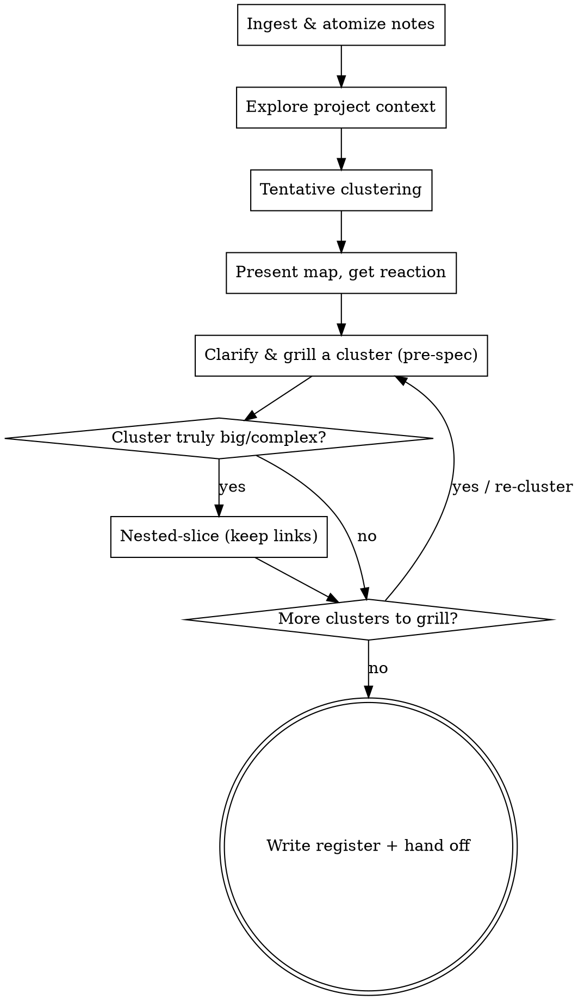

# Issue Register

Turn a messy pile of idea notes into a clustered, well-articulated **pre-spec issue map** — clarified and grilled relentlessly, borrowing brainstorming's front-half procedure, but stopping before any solution, approach, architecture, or spec.

It takes MANY raw notes (some independent, some related), clusters them into shippable groups, grills each to pre-spec, and writes a durable map with the links between groups and slices preserved.

<HARD-GATE>
Do NOT propose solutions, approaches, or architecture. Do NOT write a spec, write code, or publish implementation issues. Only clarify, cluster, and articulate to **pre-spec** — problem, intent, constraints, success criteria. Solution space begins the moment you say "we could build it as X" or "here are 2-3 approaches" — stop before that, for EVERY cluster, regardless of how obvious the solution seems. This applies to every idea regardless of perceived simplicity.
</HARD-GATE>

## Anti-Pattern: "These Notes Are Clear Enough"

Every idea dump goes through clustering and clarification, even a short one. "Obvious" ideas are where unexamined assumptions — and hidden independence between ideas — cause the most wasted work downstream. The map can be short, but you MUST cluster, grill the fuzzy parts, and keep the links.

## When to Use

- A brain-dump, notes file, several half-formed ideas, or a single underdeveloped/unclear idea.
- Unclear which ideas are independent, how they group, or which are worth pursuing.

**When NOT to use:**
- You already have ONE well-scoped idea → use `brainstorming` (or `/grill-with-docs`) directly.
- You want implementation-ready issues (vertical slices, acceptance criteria) → `/to-issues`.
- An external bug report or feature request arrived → `/triage`.

## Checklist

You MUST create a task for each item and complete them in order:

1. **Ingest & atomize** — parse the notes into discrete atomic ideas. Lose none; merge none silently.
2. **Explore project context** — if a codebase exists, read it (files, docs, recent commits). A question the codebase can answer, answer by reading — don't ask it.
3. **Tentative clustering** — group the atomic ideas into candidate clusters, each an *independently-shippable* concern. Separate "these are independent groups" from "these are one group." Present the tentative map and get a reaction BEFORE deep grilling.
4. **Clarify & grill each cluster to pre-spec** — relentlessly, one question at a time (see below). Sharpen fuzzy terms. Re-cluster as understanding sharpens.
5. **Nested slicing (only if a cluster is truly big/complex)** — split into child work-items, each still pre-spec. PRESERVE THE LINK: stable IDs + explicit parent refs.
6. **Write the register** — produce the map artifact (template below). Map-first (markdown); export to a tracker only if asked.
7. **Stop & hand off** — present the reviewed map. Per work-item the next step is depth elsewhere (`/grill-with-docs` or `brainstorming` → `/to-prd` → `/to-issues`). Do NOT cross the seam here.

## Process Flow

## Clarifying & Grilling Each Cluster (pre-spec)

Borrow brainstorming's front-half procedure, run with grilling's relentlessness — but never cross into solution space.

- **Assess scope first.** If one "idea" actually describes multiple independent subsystems, that is a signal to split it into separate clusters — don't refine the details of something that needs decomposing first.
- **Interview relentlessly about the *problem*** — never the solution. Walk each branch of the idea, resolving dependencies between decisions one at a time. For each question, provide your recommended answer.
- **One question per message.** Multiple questions at once is bewildering. Prefer multiple-choice when it sharpens the answer; open-ended is fine too.
- **If the codebase can answer it, explore instead of asking.**
- **Sharpen fuzzy or overloaded terms** into precise ones ("you say 'account' — Customer or User? Those are different things").
- **Triage the grilling:** grill what is fuzzy or important; don't grind already-clear or low-priority notes to death across a large dump.
- **Stay at pre-spec:** purpose, constraints, success criteria. The moment talk turns to *how to build it*, stop and record it as a downstream question — do not answer it here.

## The Register Artifact

A markdown file (`docs/issue-register/YYYY-MM-DD-<topic>.md`, or a project `REGISTER.md`). Groups → work-items → optional children.

Each work-item:

- **ID** — stable (`R1`, child `R1.2`)
- **Title**
- **Cluster / parent** — which group; parent ID if a child (this is the link)
- **Problem & intent** — what and why, from the user's perspective
- **Constraints** — non-negotiables, boundaries
- **Success criteria** — how you would know it is addressed (outcome, not implementation)
- **Open questions** — unresolved after grilling
- **Status** — `pre-spec` | `needs-more-grilling` | `parked`
- **Relations** — standalone, or `blocked-by` / `relates-to <IDs>`

Deliberately **NOT** in a work-item: solution, architecture, tech choices, file paths, acceptance-criteria-as-tasks. Those belong downstream.

## Clustering Rules

- A cluster is something that could be pursued or shipped **independently** of the others.
- Two notes share a cluster only if they share a *problem or outcome* — not merely a topic, technology, or vibe.
- Unsure whether two things are one cluster or two? Ask (one question). Over-merging hides independent shippables; over-splitting loses coherence.
- Every atomic note is traceable to exactly one work-item, or explicitly **parked**. Nothing silently dropped.

## Common Mistakes

| Mistake | Fix |
|--------|-----|
| Crossing the seam (proposing solutions/approaches/architecture) | Stop at problem/constraints/success. Record "how" as a downstream question. |
| Turning it into a design/spec (brainstorming's telos leaking in) | This skill's terminal state is a pre-spec map, NOT a design. Hand off for design. |
| One-idea tunnel vision (treating the whole dump as a single project) | It is usually several. Cluster first. |
| Losing links when slicing (orphaned children) | Stable IDs + parent refs, always. |
| Grilling everything to death | Triage: grill what is fuzzy or important. |
| Silent drops or merges (notes vanishing into vague clusters) | Every note → one work-item, or explicitly parked. |
| Publishing implementation issues | That is `/to-issues`' job. The register is pre-spec. |

## Key Principles

- **Cluster first, then grill** — grilling needs a target; establish tentative groups before deep interviewing.
- **One question at a time** — with your recommended answer.
- **Keep the link** — every slice remembers its parent; the map is a graph, not a shredder.
- **Stop at the seam** — pre-spec only; hand off for depth.
